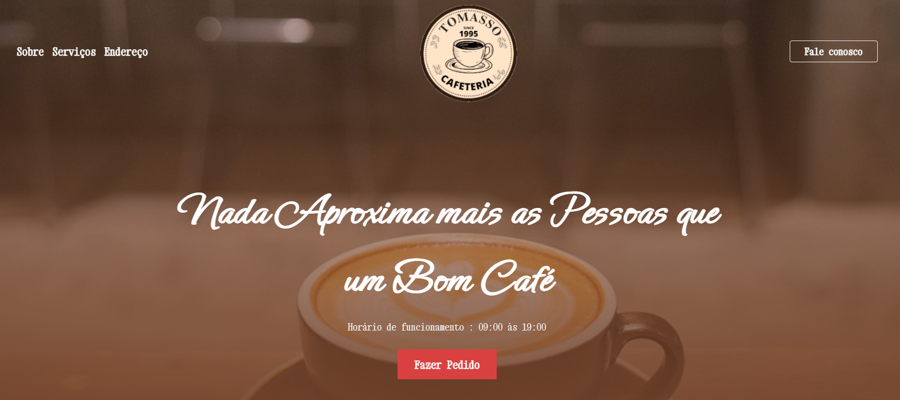
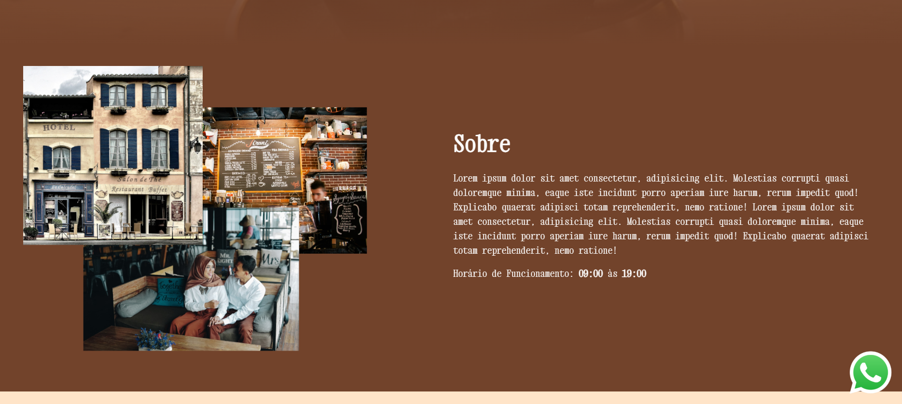
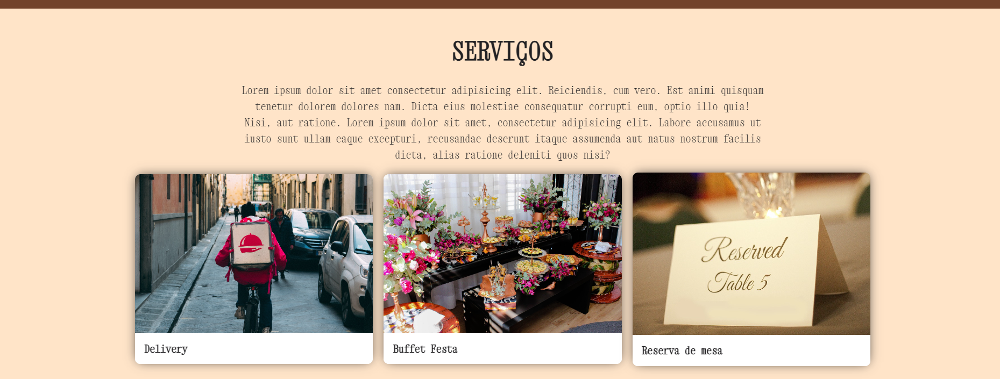
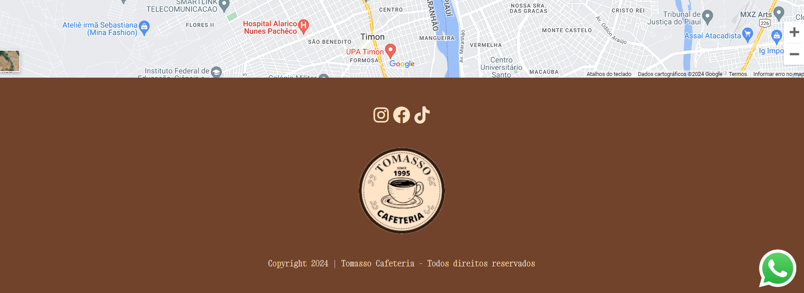

# site-cafeteria

Esse projeto foi desenvolvido para servir como sistema para uma cafeteria. O projeto conta inicialmente com uma landing page que terá suas funcionalidades de adminstração incluídas em suas próximas versões. O objetivo é facilitar o contato do cliente com os produtos.

# :hammer: Próximas Etapas do projeto

- `Funcionalidade 1`: cadastro de serviços;
- `Funcionalidade 2`: exibição de todos os serviços;
- `Funcionalidade 3`: cadastro de cardápios;
- `Funcionalidade 4`: exibição de todos os cardápios;
- `Funcionalidade 5`: autenticação para admin;
